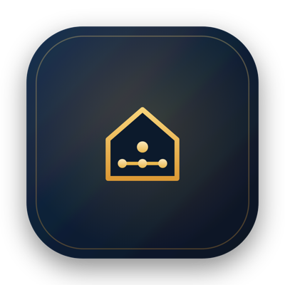
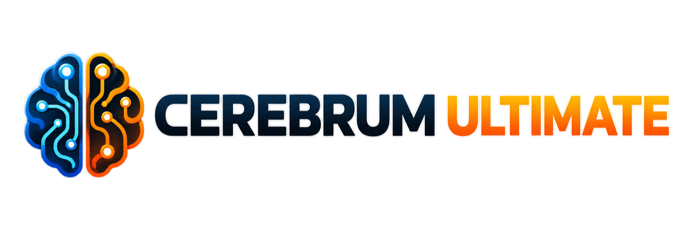

<p align="center">
  
</p>

<p align="center">
  
</p>

## The supervised home intelligence for Node-RED

Cerebrum Ultimate adds a simple, conversational layer to your Node-RED smart home. It can understand the devices already available in your flows, answer questions, help with everyday automation and learn recurring habits while keeping you in control.

KNX Ultimate, Home Assistant, HUE, Matter, UniFi Protect and TTS Ultimate are optional integrations. Cerebrum continues to work when they are not installed.

<br/>

[![NPM version][npm-version-image]][npm-url]
[![Node.js version][node-version-image]][npm-url]
[![Node-RED Flow Library][flows-image]][flows-url]
[![NPM downloads per month][npm-downloads-month-image]][npm-url]
[![NPM downloads total][npm-downloads-total-image]][npm-url]
[![MIT License][license-image]][license-url]
[![JavaScript Style Guide][standard-image]][standard-url]
[![YouTube][youtube-image]][youtube-url]

<p align="center">
  <a href="https://www.youtube.com/channel/UCA9RsLps1IthT7fDSeUbRZw/playlists" title="Visit Max Supervibe on YouTube">
    
  </a>
</p>

## Install

From **Node-RED → Manage palette → Install**, search for:

`node-red-contrib-cerebrum-ultimate`

Or install it from the command line:

```bash
npm install node-red-contrib-cerebrum-ultimate
```

Then add a **Cerebrum** node to a flow, choose your AI provider and select any compatible nodes detected in the project. Deploy the flow and open the Cerebrum Web interface from the node editor.

## What you can do

- Talk to your smart home in natural language.
- Ask for summaries, current states and recent events.
- Receive supervised suggestions based on recurring habits.
- Create reminders and scheduled checks.
- Use cameras and voice when compatible nodes are available.
- Generate reviewable Node-RED flows with the **Node-RED Flow Builder**.
- Back up and restore the Cerebrum configuration from the Web interface.

## Example flows

The package includes 15 ready-to-import flows for conversations, summaries, independent sessions, reminders, Web research, flow events, Home Assistant, Telegram, TTS and supervised KNX use.

Open **Node-RED → Menu → Import → Examples → node-red-contrib-cerebrum-ultimate** and start with **01 - First Conversation**. Each flow contains a short instruction directly in the workspace; integrations that require another package are clearly marked and never include credentials or gateway addresses.

## Compatible nodes detected

Open the Cerebrum node and use **Compatible nodes detected**. Cerebrum shows the integrations available in the current Node-RED project.

For integrations such as KNX Ultimate and UniFi Protect, the same field lets you select an existing configuration, edit it or create a new one. Nothing is required if you do not use that integration.

## KNX: ETS Access, Areas, Tests and Test Results

The KNX test workspace is designed for commissioning and troubleshooting. It helps answer practical questions such as:

- Is the correct command group address being used?
- Does the actuator publish its new status after a command?
- Does the status address answer an explicit read request?
- Does the returned value match the requested value?

This is useful when checking a new installation, after changing an ETS project, or when a light, shutter, HVAC function or other actuator does not behave as expected.

Install KNX Ultimate, select or create its gateway under **Compatible nodes detected**, and make sure the gateway contains your ETS group addresses. Cerebrum then provides this guided path:

`ETS Access → Areas → Test plans → Test Results`

Open **KNX → ETS Access** in the Cerebrum Web UI to choose the group addresses Cerebrum may use. Selected addresses are readable; selected addresses not marked **Read only** are writable after the normal local validation and, when enabled, user confirmation. Existing selections stored in the Node-RED flow are migrated automatically when this page is first saved.

### 1. Areas

An area limits the test to a clear part of the installation, such as the living room, the first floor, the lighting system or the HVAC system. This makes it easier to select the correct addresses and avoids testing unrelated devices.

Open **KNX → Areas** to:

- Select an area suggested from the ETS structure, or create one.
- Give it a clear name and choose the group addresses that belong to it.
- If AI is enabled, Cerebrum can help suggest the most relevant addresses.

An area must contain at least one group address before it can be used in a test.

### 2. Tests

Cerebrum can perform two kinds of checks.

#### Read-only diagnosis

A read-only diagnosis does not operate any actuator. It examines the KNX traffic already observed for the selected area and reports:

- which group addresses have recently been active;
- which addresses have remained silent;
- whether recent anomalies belong to that area;
- whether the observed activity matches the selected diagnostic profile.

This is the safest first check. A silent address is not automatically faulty: the related device may simply have had no reason to transmit during the observation period.

#### Active functional test

An active test checks the complete command-and-feedback path. For each configured step, Cerebrum can:

1. Send the requested value to the command address.
2. Wait for the status address to publish a spontaneous update.
3. Read the same status address and wait for its response.
4. Compare both feedback values with the value that was expected.

In KNX terms, this means sending a command telegram, observing the status `GroupValue_Write`, then sending a `GroupValue_Read` and checking the returned `GroupValue_Response`.

For example, when testing a living-room light, Cerebrum sends **On** to its command address, waits for the status address to report **On**, reads that status once more and checks that the response is still **On**. This verifies much more than simply seeing the light switch.

These two feedback checks help distinguish common problems. For example, an actuator may update its status spontaneously but not answer reads, answer reads but not publish changes, return an unexpected value, or provide no feedback at all.

Open **KNX → Tests**, select an area and start a new plan. Standard templates are available for lights, shading, HVAC and the main actuators. Before running the test you can:

- review and change every command and status address;
- check the DPT (KNX data type) and expected value;
- add pauses between operations;
- save the plan for later use;
- run it once or repeat it until you stop it.

> Active tests send real telegrams to the KNX bus. Cerebrum always shows a confirmation before starting: review the plan and make sure the installation is safe to operate.

The tests verify KNX communication and configured feedback. They do not replace electrical, mechanical or on-site safety checks.

### 3. Test Results

Open **KNX → Test Results** to follow a running test or inspect a saved report:

- **Pass** means all configured checks for that step succeeded.
- **Warning** means a possible issue needs attention; in an active test, this usually means that only one of the two feedback checks succeeded.
- **Fail** means feedback was missing, arrived too late or contained a different value.

If a step has no status address, Cerebrum can confirm only that the command telegram was sent. A successful write-only step does **not** prove that the physical actuator moved or that the load switched.

Each report contains the command used, the received feedback, timing details and practical suggestions. You can reopen the source plan, delete an old result or export the report as a PDF for commissioning records.

## Home Assistant

Connect Cerebrum's dedicated **Home Assistant** output to a Home Assistant `ha-api` node, then return the API output to Cerebrum's input:

```text
Cerebrum output 6 (Home Assistant) → API (ha-api) → Cerebrum input
```

Select the Home Assistant server in `ha-api`, deploy the flow and use Setup Doctor if Cerebrum reports a missing connection. Cerebrum correlates API responses internally; no additional bridge node is required.

## Safety and privacy

Cerebrum separates observation, suggestion, confirmation and execution. A learned habit never becomes an automatic command without the user's approval, and KNX group addresses marked read-only cannot receive writes.

Home data stays local unless a configured remote AI provider needs it to answer a request. For a fully local setup, use a compatible local provider such as Ollama or LM Studio.

## Local memory and backup

Cerebrum stores its memory inside the Node-RED user directory. The Web interface provides simple views for **Cerebrum Memory** and **Cerebrum Learning**, plus **Settings → Import / Export** for backups.

## Adapter API

Optional packages can register an adapter and one or more providers without importing KNX Ultimate:

```js
const { getAdapterRegistry } = require('node-red-contrib-cerebrum-ultimate')

const registry = getAdapterRegistry()
registry.registerAdapter({
  id: 'my-adapter',
  title: 'My adapter',
  capabilities: ['states', 'events'],
  access: 'observe'
})
registry.registerProvider({
  id: 'my-controller',
  adapterId: 'my-adapter',
  title: 'My controller',
  capabilities: ['states'],
  subscribe: listener => {
    // Return an unsubscribe function.
    return () => {}
  }
})
```

Provider callbacks must catch their own I/O errors. Cerebrum also isolates provider, flow-hook, timer, storage and output failures so an adapter cannot terminate Node-RED.

## License

Released under the [MIT License][license-url].

[npm-url]: https://www.npmjs.com/package/node-red-contrib-cerebrum-ultimate
[npm-version-image]: https://img.shields.io/npm/v/node-red-contrib-cerebrum-ultimate.svg
[node-version-image]: https://img.shields.io/node/v/node-red-contrib-cerebrum-ultimate?logo=node.js&logoColor=white
[npm-downloads-month-image]: https://img.shields.io/npm/dm/node-red-contrib-cerebrum-ultimate.svg
[npm-downloads-total-image]: https://img.shields.io/npm/dt/node-red-contrib-cerebrum-ultimate.svg
[flows-image]: https://img.shields.io/badge/Node--RED-Flow%20Library-white?logo=nodered&logoColor=8F0000
[flows-url]: https://flows.nodered.org/node/node-red-contrib-cerebrum-ultimate
[license-image]: https://img.shields.io/badge/license-MIT-blue.svg
[license-url]: https://github.com/Supergiovane/node-red-contrib-cerebrum-ultimate/blob/main/LICENSE
[standard-image]: https://img.shields.io/badge/code_style-standard-brightgreen.svg
[standard-url]: https://standardjs.com
[youtube-image]: https://img.shields.io/badge/YouTube-Max%20Supervibe-red?logo=youtube&logoColor=white
[youtube-url]: https://www.youtube.com/channel/UCA9RsLps1IthT7fDSeUbRZw/playlists
